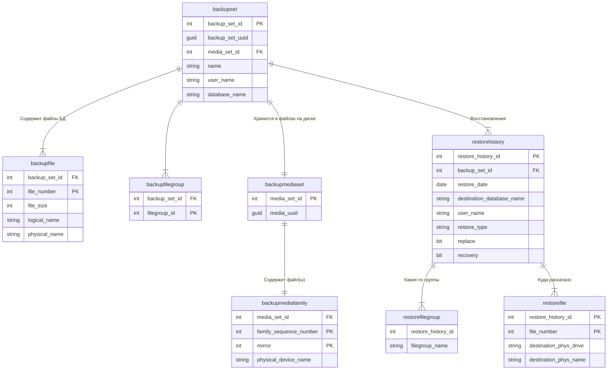

# Копирование журналов резервных копий между SQL-серверами

Журналы резервных копий хранятся в БД `msdb`.

Копируем их на другой SQL-сервер,
чтобы иметь возможность раскатывать на нём
резервные копии штатными средствами `SQL Server Management Studio`.



## Prerequisites

- Установите модуль `SimplySql`
- Дать права пользователю `System` на SQL
    + `msdb`/`db_datareader` на источнике
    + `sysadmin` на приёмнике
- Создать задание
    ```powershell
    .\bak-replica.ps1 -install
    ```
